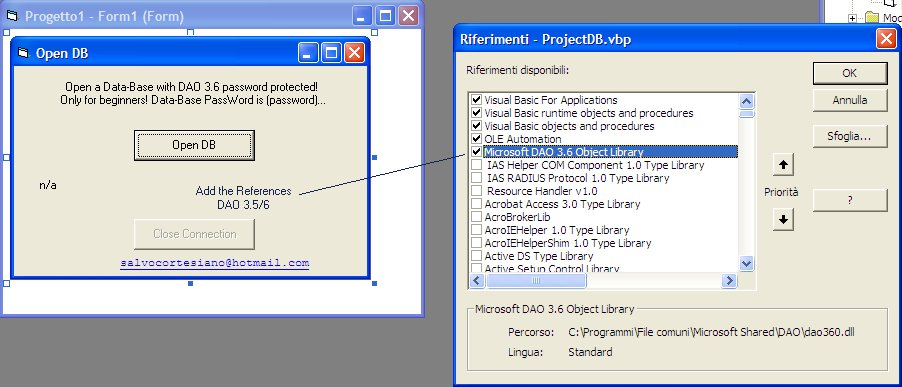



## Open Data\-Base with DAO 3\.5/6 password protected\!

### Description

Open a DB via DAO 3.5/6 with password protected! This code just for beginners like me ;)

Not rated please, commented only. Thank you!
 
### More Info
 

             |
---                |---
**Submitted On**   |2008-11-03 10:59:16
**By**             |[Salvo Cortesiano \(Italy\)](https://github.com/Planet-Source-Code/PSCIndex/blob/master/ByAuthor/salvo-cortesiano-italy.md)
**Level**          |Intermediate
**User Rating**    |5.0 (15 globes from 3 users)
**Compatibility**  |VB 5\.0, VB 6\.0
**Category**       |[Databases/ Data Access/ DAO/ ADO](https://github.com/Planet-Source-Code/PSCIndex/blob/master/ByCategory/databases-data-access-dao-ado__1-6.md)
**World**          |[Visual Basic](https://github.com/Planet-Source-Code/PSCIndex/blob/master/ByWorld/visual-basic.md)
**Archive File**   |[Open\_Data\-21336911102008\.zip](https://github.com/Planet-Source-Code/salvo-cortesiano-italy-open-data-base-with-dao-3-5-6-password-protected__1-71377/archive/master.zip)

### API Declarations

In the Module (zip)

